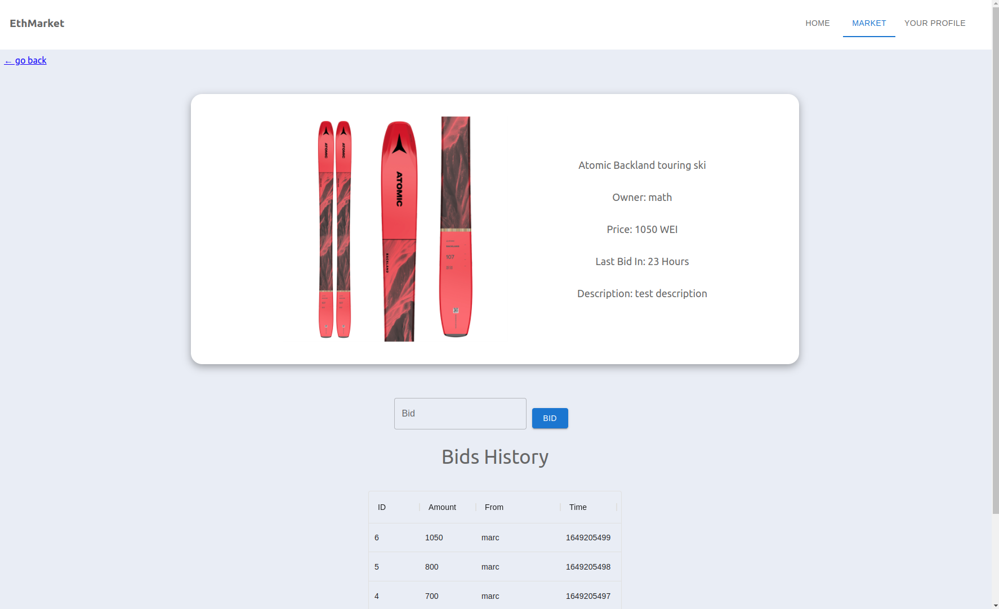
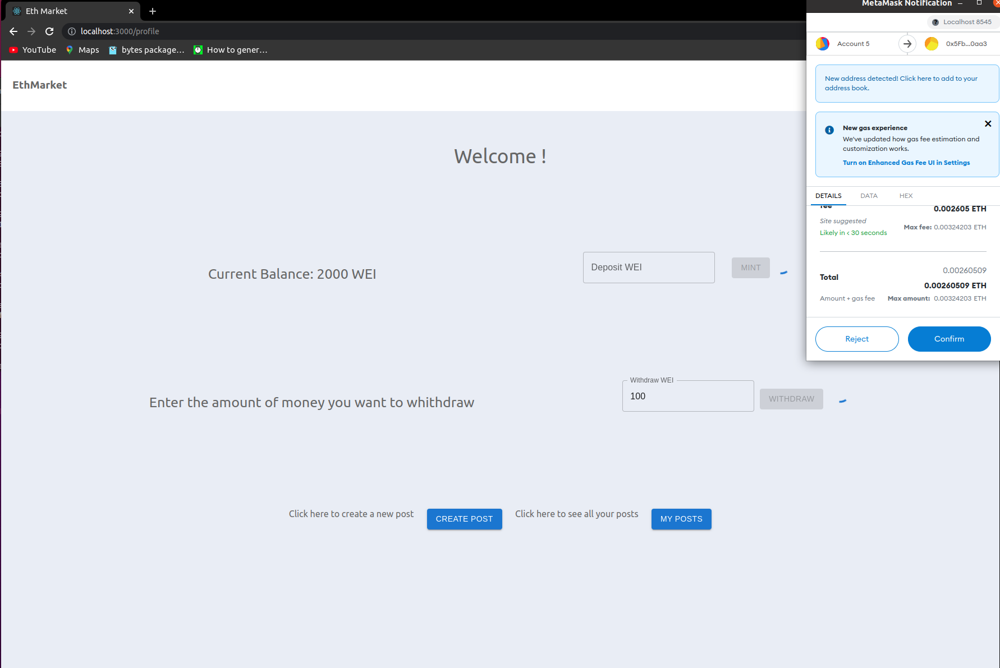

# Eth Market, a simple store to sell used products

This project is a simple used product market. I did it to learn how to write smart contracts and how to interact with a blockchain with a frontend application. This application is built with Hardhat, an Ethereum development environment, and React. I used Solidity for the smart contracts and Typescript for the web application.

## Installation

*Download the source code
*Run npm install
*Open three terminals
*In the first one, run npm start
*In the second one, run npx hardhat node
*In the third one, run npx hardhat run --network localhost scripts/deployDev.js

## Quick look

**Store page**

**Product page**

**Profile page while using Metamask to withdraw**

